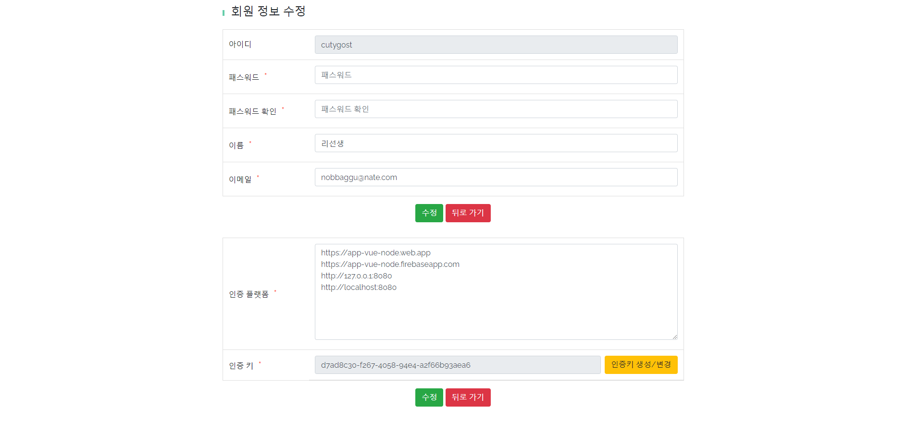

# [Node 도서관리시스템](https://book.nobbaggu.kr)

# 1. 프로젝트 개요

## - 교육 과정 프로젝트 : 참여율 100%

## - 해당 Node(CRUD) 프로젝트 자체 이해도 95%

## - 해당 도서관리시스템(CRUD) 구축은 3회 반복 구현연습 진행

## - Node에 대한 생각(첫 프로젝트)

- node는 첫 프로젝트 이후 매우 중요하게 본인에게 필요한 기능의 언어라 판단
- 평일 주5일 09시~18시까지 JS개발자 과정 참여 후 추가로 일요일 Node수업에 참여함
- 평일 수업에서 배운 CRUD구현에 대한 과정을 동일하게 복습할 수 있는 시간
- Node로 Front, Back구분 없이 어느정도까지는 생각하는 아이템의 창업화가 가능하다고 확신함!

---

# 2. 프로젝트 방향

## - 첫 CRUD 구축 프로젝트(node.js)

## - node 활용 front, back 구분없이 one-page 형태로 제작

---

# 3. 사실적 의견

## - front부분에서 API활용, 인증(token)을 통해 서버(back) 접근 승인

## - 100% 직접 코드 구현은 어렵지만 기존의 내용에서 기능 변경, 추가는 가능함

## - back에서 ejs를 사용해 view부분 전체 구축, sns로그인, 인증 등

## - passport를 통해 kakao, naver 이외에도 다른 플랫폼 기능 활용 가능(api)

---

# 4. 고도화 방향

## - node 활용으로 single페이지 구축도 괜찮지만 front, back 분리가 필요함

## - mvp검증 후 다시 front/back 나눠서 개발도 좋지만 개발자는 항상 확장(고도화)을 생각해야함

## - 언어 관련 modules(lang-init.js) 활용해 중국어 추가 반영

## - 도서목록파일을 json형태로 back서버에서 다른 url로 전달해주는 기능(?) : 전체 데이터 전송

---

# 5. 프로젝트 기획

## - node의 가장 기초부터 배우며 프로젝트 진행

## - express 사용, middleware, router, view, module 등으로 폴더 분할 작업

## - NPM 활용을 처음부터 직접 진행하며 익숙해지는 연습

## - node에서는 npm활용, react에서는 yarn 활용으로 javascript 디펜던시 활용도 상승

---

# 6. 프로젝트 결과

## 

## 

## 

## 

## 

---

## 7. Dependencies

- pm2
- axios
- kakaoAPI
- naverAPI
- mysql2
- bcrypt
- dotenv
- jsonwebtoken
- lodash
- uuid
- multer
- validator
- passport
- validator

---

## 8. Server

## - AWS EC2 / MySQL

---

## 9. 생각

## - 간단하더라도 본인이 직접 1page짜리 CRUD 게시판을 반드시 구현할 수 있어야함

## - 데이터 입력과 출력을 통한 GET, PUT에 대한 탄탄한 개념 및 실습 매우 많이 필요함
